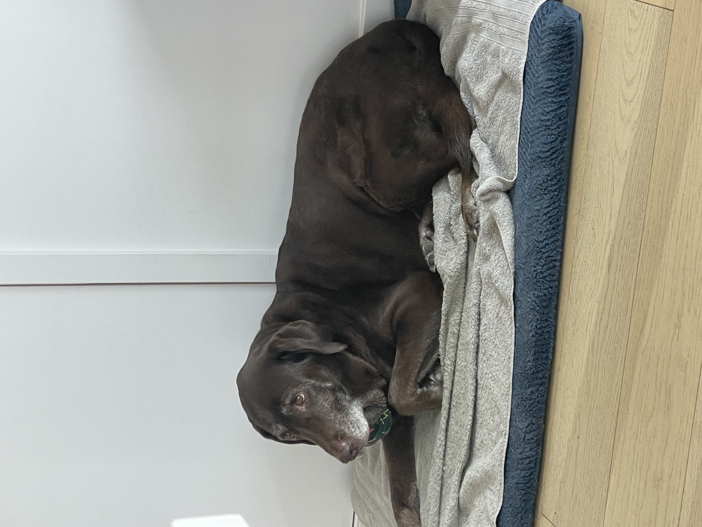
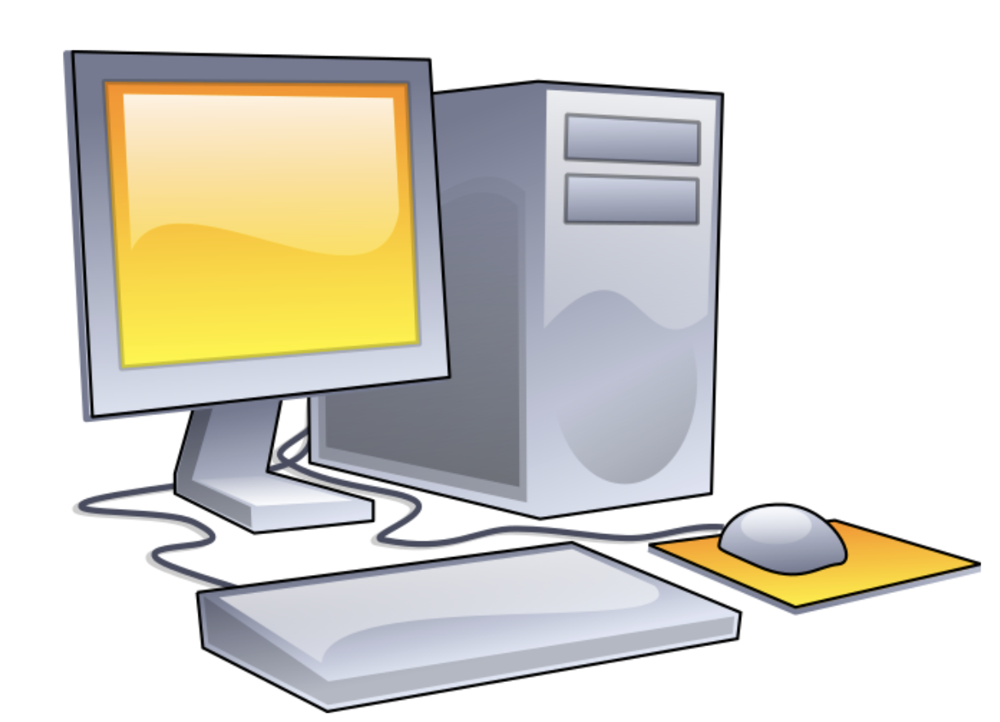

# About Me

## General Introduction
Hello my name is Sierra Myers and I am a second year computer science major at _UCSD_. I am from Ventura, CA and a fun fact about me is a have a chocolate lab named Coco.

*More photos of my dog*
[Coco at the beach](beach.jpeg)
[Coco resting](rest.jpeg)

>***Some of Coco's Favorite Things*** 
- Walks in the neighborhood
- **Food**
- Being petted
- Going on car trips
- **Going on hikes** 
- Going to the beach

## Experience with Programming

### Languages I'm Familiar With
1. [Python](https://www.python.org/) : `print("Hello World!")`
2. [Java](https://www.java.com/en/) : `System.out.println("Hello World!");`
3. [C](https://en.wikipedia.org/wiki/C_(programming_language)) : `printf("Hello, world!\n");`
4. [C++](https://cplusplus.com/): `cout << "Hello World!;`

## Goals
Here are some goals I'd like to accomplish (and some I already have)
- [ ] Learn a new programming language
- [ ] Travel to another country
- [ ] Get my drivers liscense
- [x] Join more clubs
- [x] Wake up early enough to see the sunrise

## Navigation Help 
>Links to parts of this page:
[Link to General Introduction](https://github.com/sierra392/cse110Lab1/blob/main/index.md#general-introduction)
[Link to Experience with Programming](https://github.com/sierra392/cse110Lab1/blob/main/index.md#experience-with-programming)
[Link to Goals](https://github.com/sierra392/cse110Lab1/blob/main/index.md#goals)